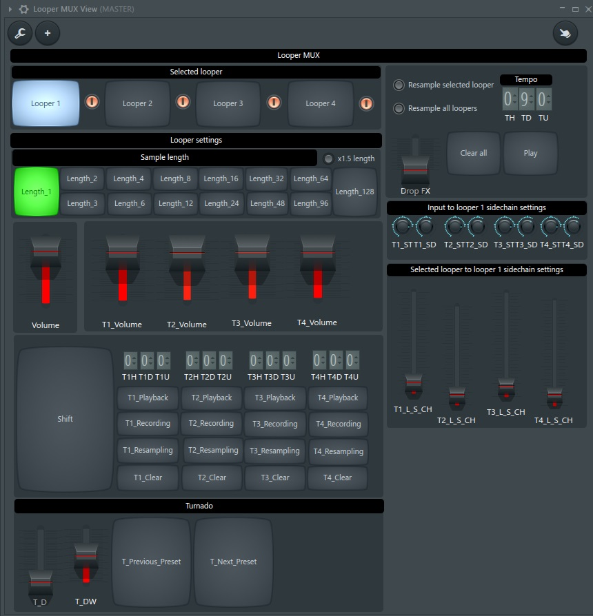

# The Livelooping project

### BEEP... this document is in "work in progress" state.

## Table of contents

- [Where am I?](#where-am-i)
- [Thanks to](#thanks-to)
- [Some dust in your eyes](#some-dust-in-your-eyes)
- [Sub-articles](#sub-articles)
  * [Prerequisites](#prerequisites)
  * [Installation](#installation)
  * [Looper mux](#looper-mux)
- [Additional materials](#additional-materials)

## Where am I?

You are on the page of the svlad-90's **Livelooping** project!

It implements a set of the logical devices, that allows you to create music live, using beatboxing, vocals, or any other type of instrument(s), which you have under your hand.

It is something similar to what Boss RC-505, RC-300, Korg KP3+ propose on the market.

But on top of it the "second device", the effector, is also in place. The set-up does not need any Line 6 Helix, or something similar. All effects you need are within the used DAW.

----

## Thanks to

This project is inspired by [Beardyman](https://www.beardyman.co.uk/), who is the pioneer in live-looping area for around 15 years. Kudos to you, Beardyman! ))

----

## Some dust in your eyes

This section should contain something, that will make you read till the end. 

Let me place here the screen-shot of the logical device's views, without explaining what is located there.

I'm pretty sure, that my colleagues loopers will recognize main features :)

**"Looper mux" logical device:**

**"Input controller" logical device:**

**All devices put together:**

The idea behind each knob and button and details regarding how all that works will be described below.

----

## Sub-articles

### [Prerequisites](./md/prerequisites/prerequisites.md)
### [Installation](./md/installation/installation.md)
### [Looper mux](./md/looper-mux/looper-mux.md)

----

## Additional materials

- The following video, which gives some insides on the "Beardytron 5000" project, is a basic idea of what is implemented here. Watch it, if you wish to have a deep dive into the topic:

  

- FL MIDI scripting API reference - https://www.image-line.com/fl-studio-learning/fl-studio-online-manual/html/midi_scripting.htm
- FL MIDI scripting forum - https://forum.image-line.com/viewforum.php?f=1994