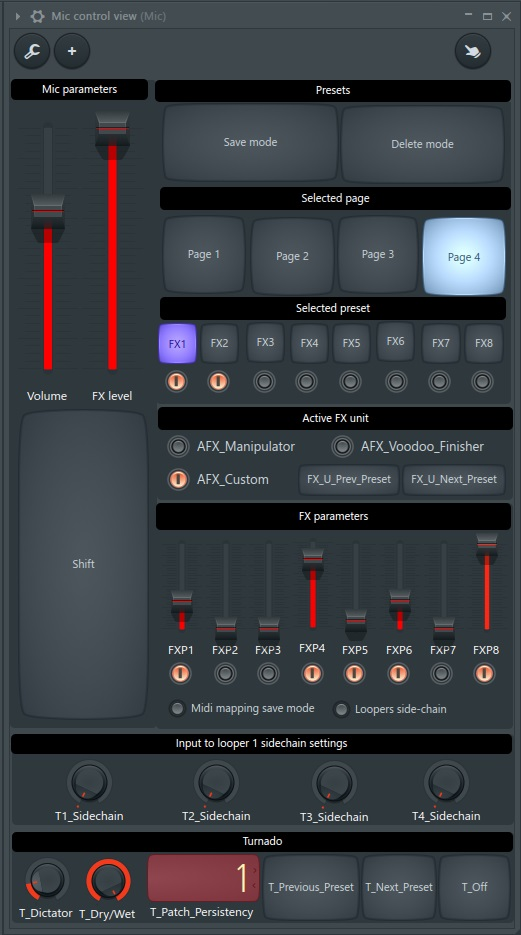
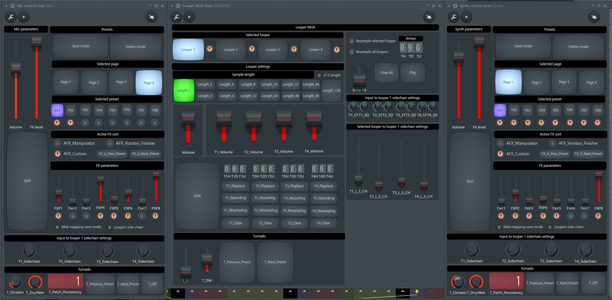

# The LIVELOOPING project

----

## BEEP... this document is in "work in progress" state. The work is ongoing RIGHT NOW. It will be done in the several days.

----

## Table of contents

- [Where am I?](#where-am-i)
- [Thanks to](#thanks-to)
- [Pull the wool over your eyes](#pull-the-wool-in-your-eyes)
- [Sub-articles](#sub-articles)
- [Additional materials](#additional-materials)

----

## Where am I?

You are on the page of the svlad-90's **LIVELOOPING** project!

It implements a set of the logical devices, that allows you to create music live, using beatboxing, vocals, or any other type of instrument(s), which you have under your hand.

It is something similar to what Boss RC-505, RC-300, Korg KP3+ propose on the market.

But on top of it the "second device", the effector, is also in place. The set-up does not need any Line 6 Helix, or something similar. All effects you need are within the used DAW.

One advantage of the project is the sound quality, which you'll get.

Another one is that it is an open-source project. With not so much efforts you can exchange the set of the used FX plugins with your own favorite ones. Or you can implement additional feature. Or support usage of the project with your custom MIDI controllers.

----

## Thanks to

This project is inspired by [Beardyman](https://www.beardyman.co.uk/), who is the pioneer in live-looping area for around 15 years. Kudos to you, Beardyman! ))

----

## Pull the wool over your eyes

This section should contain something, that will make you read the document till the end. 

Let me place here the screen-shot of the logical device's views, without explaining what is located there. This should pique your interest.

I'm pretty sure, that my colleagues, loopers, will recognize the main features :)

**"Looper mux" logical device:**

**"Input controller" logical device:**

**All devices put together:**

The idea behind each knob and button and details regarding how all that works will be described below.

----

## Sub-articles

### [Prerequisites](./md/prerequisites/prerequisites.md) - what do you need to run this project?
### [Installation](./md/installation/installation.md) - how to install this project?
### [Looper mux](./md/looper-mux/looper-mux.md) - details regarding usage of the "looper mux" logical device
### [Input controller](./md/input-controller/input-controller.md) - details regarding usage of the "input controller" logical device

----

## Additional materials

- The following video, which gives some insides on the "Beardytron 5000" project, is a basic idea of what is implemented here. Watch it, if you wish to have a deep dive into the topic:

  

- FL MIDI scripting API reference - https://www.image-line.com/fl-studio-learning/fl-studio-online-manual/html/midi_scripting.htm
- FL MIDI scripting forum - https://forum.image-line.com/viewforum.php?f=1994