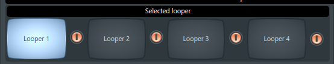

# The Livelooping project

### BEEP... this document is in "work in progress" state.

## Where am I?

You are on the page of the svlad-90's **Livelooping** project!

It implements a set of the logical devices, that allows you to create music live, using beatboxing, vocals, or any other type of instrument(s), which you have under your hand.

It is something similar to what Boss RC-505, RC-300, Korg KP3+ propose on the market.

But on top of it the "second device", the effector, is also in place. The set-up does not need any Line 6 Helix, or something similar. All effects you need are within the used DAW.

----

## Thanks to ...

This project is inspired by [Beardyman](https://www.beardyman.co.uk/), who is the pioneer in live-looping area for around 15 years. Kudos to you, Beardyman! ))

----

## Some dust in your eyes

This section should contain something, that will make you read till the end. 

Let me place here the screen-shot of the logical device's views, without explaining what is located there.

I'm pretty sure, that my colleagues loopers will recognize main features :)

**"Looper mux" logical device:**

**"Input controller" logical device:**

**All devices put together:**

The idea behind each knob and button and details regarding how all that works will be described below.

----

## Prerequisites

This project won't work out of the box, just because you have a PC. You'll need a set of certain the soft-ware and hard-ware, to get started.

### DAW

The **FL Studio** DAW of at least **"Producer edition"** or higher - https://www.image-line.com/fl-studio/compare-editions/

Why FL Studio was selected?
- This is the DAW, which I'm using for more than 10 years
- It provides the python-based MIDI scripting API, which perfectly fits for the task

Probably, you will need to have the latest version of the FL Studio, because:
- I've bought FL Studio and do have the lifetime updates. Thus, I'll continue to support this project against the HEAD version of the FL Studio.
- Old versions have bugs inside the FL MIDI scripting engine. I do not work-around them, as they were already fixed in the latest versions.

### VST plugins

The project is building the logical devices on the top of the FL Studio DAW and bunch of the VST plugins. Here is the list of the external VST plugins, which you'll need to have on top of the FL studio in order to have the project running:

- **Edless Smile by DADA LIFE** - https://dadalife.com/plugins/

- **Turnado 2 by sugar-bytes** - https://sugar-bytes.de/turnado

- **Fab filter Pro-Q 3** - https://www.fabfilter.com/products/pro-q-3-equalizer-plug-in

- **Finisher VOODOO by ujam** - https://www.ujam.com/finisher/voodoo/

- **Manipulator by polyverse music** - https://polyversemusic.com/products/manipulator/

- **Augustus Loop by Expert Sleepers** - https://www.expert-sleepers.co.uk/augustusloop.html

Just buy, and install the above set of the VST plugins, to have the project up and running.

Besides the external VST plugins, the bunch of the internal FL Studio's VST plugins are also used:

- Control surface
- Fruity Limiter
- Edison
- Fruity Compressor
- Fruity Panomatic
- Fruity Fast Dist
- Fruity Stereo Enhancer
- Fruity Reverb 2
- Fruity Delay 2
- Fruity Filter
- Fruity Peak Controller

But all the above ones are part of the FL Studio delivery. So you do not need to worry about them.

### Hardware

- **2-3 instances of the Korg Kaoss Pad 3+**

    
  
  The project consists of the 3 logical devices:
  - 1 instance of the "looper mux" device. This device is in control of the recorded tracks.
  - 2 instances of the "input controller" devices. Each instance can be used to process one audio input channgel. E.g. I'm using one of such devices for mic, and the other for synthesizer.

  Each device is controlled by a separate instance of the **Korg Kaoss Pad 3+** - https://www.korg.com/us/products/dj/kaoss_pad_kp3_plus/

  So, to effectively use this project, you will need to have 2-3 instances of the **Korg Kaoss Pad 3+**.

  ***Important note!*** In this project, KP3+ instances are used ONLY as MIDI controllers! No effector or sampler capabilities are being used. So, eventually, you can replace it with any other MIDI controller, which will have enough buttons and knobs. Still, you'll need to slightly change the python code, as currently assigned MIDI messages are KP3+ specific. Also, you might need to change the workflow described in the code, as current implementation is done considering the KP3+ form-factor.

- **Audio interface**

  To work with the livelooping project, I'm using the **Zoom UAC-8 Audio converter** - https://zoomcorp.com/en/jp/audio-interface/audio-interfaces/uac-8/.
  
    
  
  Usage of it with 96000 Hz sample rate and 512 smp buffer length allows to have ~6 ms latency, while having nice and stable workflow.

  But, in general, any USB 3.0 sound-card with at least 2 inputs and possibility to work with 96-192 Hz sample rate should be sufficient. E.g. Komplete Audio 6 by NI should also work fine - https://www.native-instruments.com/en/products/komplete/audio-interfaces/komplete-audio-6/.

- **Mic**

  If you would work with vocals or beatboxing ( like I do ), you'll definitely need a mike. For beatboxing I would suggest the following 3 models:
  - Sure SM58 - https://www.shure.com/en-US/products/microphones/sm58
  
  - Sennheiser e-945 - https://en-us.sennheiser.com/vocal-microphone-dynamic-super-cardioid-e-945
  
  - DPA d:facto FA4018 - https://www.dpamicrophones.com/handheld/vocal-microphone ( used on GBB )
  

- **Headphones**

  For sure you are free to use the speakers, but my experience shows, that you might want to practise not producing too much noise. The headphones which I'm using are:
  - Beyerdynamic DT 770 PRO - https://europe.beyerdynamic.com/dt-770-pro.html
  

----

## Installation

In order to install the project one would need to:

- Install the [DAW](#daw)
- Install the [External VST plugins](#vst-plugins), and make sure that the DAW sees them
- Clone this git repository
- Connect and set-up your audio interface
- Connect your input devices ( mic, synth ) to your audio interface
- Connect the KP3+ instances to your PC via the USB and set-up the drivers
- Copy the **"${project_root}\device_KorgKaossPad3Plus_LooperMux"** folder to the **"C:\Users\<your_user>\Documents\Image-Line\FL Studio\Settings\Hardware"**
- Copy the **"${project_root}\device_KorgKaossPad3Plus_SynthController"** folder to the **"C:\Users\<your_user>\Documents\Image-Line\FL Studio\Settings\Hardware"**
- Copy the **"${project_root}\device_KorgKaossPad3Plus_MicController"** folder to the **"C:\Users\<your_user>\Documents\Image-Line\FL Studio\Settings\Hardware"**
- Copy the **"${project_root}\commmon"** folder to the **"{fl_studio_root}\Shared\Python\Lib"**
- Copy the **"${project_root}\input_controller"** folder to the **"{fl_studio_root}\Shared\Python\Lib"**
- Open the **"live_looping.flp"** project inside the DAW
- Enter the MIDI settings:

  

- Assign the scripts to the KP3+ instances:

  

  **Note!** In my case, one of the KP3+ is sending MIDI data through the ZOOM UAC-8 MIDI. That's why you see **"KP3+ 1 PAD"**, **"KP3+ 2 PAD"** and **"ZOOM UAC-8 MIDI"**. Anyway, the roles are properly assigned:
  
  * **"KP3+ 1 PAD"** - device_KorgKaossPad3Plus_SynthController
  * **"KP3+ 2 PAD"** - device_KorgKaossPad3Plus_LooperMux
  * **"ZOOM UAC-8 MIDI** - device_KorgKaossPad3Plus_MicController
  
  In your case the **"ZOOM UAC-8 MIDI** might be replaced with **"KP3+ 3 PAD"**. That's it

- Move each KP3+ instance to the "MIDI Controller" mode, using the **"Shift + 8"** shotcut
- Move the knobs and see whether the logical device's views react on the input
- Enter the mixer view:

  

- Visit channel 6 and assign the input source in a way that your mic's signal goes there:

  

- Visit channel 10 and assign the input source in a way that your synth's ( or any second instrument's ) signal goes there:

  

  **Note!** In the above 2 steps the "Input X", which you'll select will depend on commutation of your hardware. Do not blindly follow this instruction :)

- Check, whether you hear your instruments in the headphones. If yes - **then my congratulations**!

**You are ready to go!**

----

## Looper mux

### Selecting the looper instance

The "looper mux" logical device consists of 4 looper instaces:

By default looper **#1** is selected.

You can switch to other loopers using the **"Hold + X"** shortcut on KP3+, where X is one of the digits from 1 to 4:

**Note!** When you are selecting the looper, majority of the parameters will represent the state of the selected looper, leaving the non-selected loopers in shadow.

----

### Selecting the sample length

After the target looper is selected, the next thing any normal looper would think of is to select the length of the recorded phrase:

The supported sample lengths are from 1, 2, 4, 8, 16, 32, 64 and 128 beats. You can select the length using the 1-8 digits:

----

### Recording audio to the track

Each looper instance has 4 tracks:

So, in sum you have 4 loopers * 4 tracks = 16 tracks to work with.

Someone would say that it is not enough, and it would be better to have unlimited number of tracks. I'm saying:
- It is already more than in majority of the available physical loopers
- Constraints increase your creativity
- Do not judge yet, as there is a resampling functionality, which allows you to resample multiple tracks back to any other track. Be patient :)

You can start recording to the track using the A, B, C, D buttons on the KP3+ instance:

**A** button will start recording on the first track of the selected looper.

**B** - on the second.

**C** - on third.

**D** - on fourth.

Quite intuitive.

Once the recording is started, the view will reflect that:

The following things will change:
- The **Recording** status label of the selected track will become red.
- The **Length** value will change from 000 to the active length value.

In order to stop the recording - press the button of the recorded track ( A, B, C or D ) once again.

The view will change its status to play-back:

**Note!** I should mention the following aspects here:
- If recording is not stopped after reaching the "sample length", the second and further layers will be recorded on top of the initially recorded phrase. So, remember to stop recording in  time. In other cases it might be even a usefull feature, e.g. in order to make a vocal chords.
- If recording is being stopped and is then started again to the same track, 2 variants are possible:
  * If the sample length of the track **IS EQUAL** to the currently selected sample length - additional audio data will be layered on top of the existing audio materials
  * If the sample length of the track **IS NOT EQUAL** to the currently selected sample length - the track will be cleared and new data will be recorded instead of it
- If recording to the track X is ongoing, but you are starting recording to the Y track - recording of X track will stop
- If recording to the track X is ongoing, but you are selecting another active looper - the recording of track X will stop

----

### Erasing the track

In order to erase the track you the **"Hold + X"** shortcut on KP3+, where X is one of the track buttons from A to D:

Once clear option is selected, the clear button of the track will blink once in the view:

Once the track is erased, the view will change its state to "all off":

As you can see, there are no active status anymore. Also, that length of the track is reset to 000.

**Note!** Erasing the track **DOES NOT** stop recording to it. It is a useful option, as it allows you to instantly clear the part of the audio, which has an "error", without stopping further recording. You can consider it as a fast "let's try it again" option.

----

### Changing the volume of the loopers

The volume of the selected looper can be changed using the level fader of the KP3+:

The view will reflect it on the **"Volume"** slider inside the DAW:

On top of that you can instantly mute and unmute each individual looper by double clicking on digits 1 to 4:

The used number identifies the number of the affected looper.

The mute status would be reflected in the view:

Moreover, the looper's volume value would also change to 0:

**Note!** Actually, the mute tearm means "set the volume of the looper to 0%". And unmute means "set the volume of the looper to 100%". So, both approaches to set the looper volume ( via level fader and via double-click ) do actually operate on the same "Volume" parameter. That also means, that any touch to the volume fader will "unmute" the selected looper, as it will change the value of the volume parameter.

**Note!** If looper has non-zero volume ( even if it is 1% ), it is considered as unmuted. Thus, the first double-click will first set the volume to 0.

----

# Resetting the looper

You can reset a single looper to the initial state, using the **"Hold + 7"** shortcut:

That will erase all recorded tracks and set all the looper's parameters back to initial state.

----

# Resseting the looper mux

You can reset the whole "looper mux" logical device, using the **"Hold + 8"** shortcut:

That will reset each individual looper. Also it will set all non-looper-specific parameters back to the initial state.

----

## Additional materials

- The following video, which gives some insides on the "Beardytron 5000" project, is a basic idea of what is implemented here. Watch it, if you wish to have a deep dive into the topic:

  

- FL MIDI scripting API reference - https://www.image-line.com/fl-studio-learning/fl-studio-online-manual/html/midi_scripting.htm
- FL MIDI scripting forum - https://forum.image-line.com/viewforum.php?f=1994