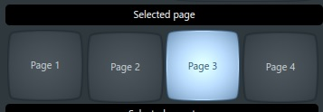
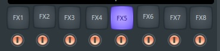
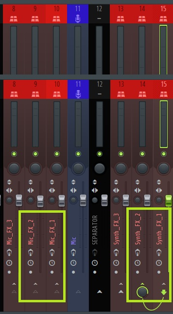
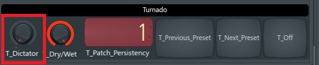
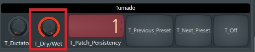

[Go to the previous page](../../README.md#sub-articles)

----

# Table of contents

- ["Input controller" logical device](#input-controller-logical-device)
  * [Selecting the preset page](#selecting-the-preset-page)
  * [Selecting the preset](#selecting-the-preset)
  * [Changing the volume level](#changing-the-volume-level)
  * [Changing the FX level](#changing-the-fx-level)
  * [Saving the preset](#saving-the-preset)
  * [Deleting the preset](#deleting-the-preset)
  * [Creating and editing the preset](#creating-and-editing-the-preset)
    * [VST parameters](#vst-parameters)
	* [Active FX unit](#active-fx-unit)
	* [MIDI mapping](#midi-mapping)
  * [Applying Turnado effect to the input controller](#applying-turnado-effect-to-the-input-controller)
	* [Changing the Turnado dictator value](#changing-the-turnado-dictator-value)
	* [Changing the Turnado Dry/Wet value](#changing-the-turnado-dry-wet-value)
	* [Randomizing Turnado](#randomizing-turnado)
	* [Switching between the Turnado VST presets](#switching-between-the-turnado-vst-presets)
  * [FX parameters](#fx-parameters)
    * [Changing FX parameter values](#changing-fx-parameter-values)
    * [FX units](#fx-units)
	* [MIDI mapping assignment](#midi-mapping-assignment)
----

# "Input controller" logical device

The "input controller" logical device is something, that works with your input audio signal before it reaches the [looper mux](../looper-mux/looper-mux.md). It's purpose is to replace your "second device", e.g. Helix Line 6, Boss GT10b, etc.

The **LIVELOOPING** project supports 2 instances of the "input controller" logical device. Meaning that you can independently operate on 2 instruments:

For sure, it is not mandatory to use the second instance of the "input controller" device.

E.g. if you perform purely as "beatbox-only" and "everything from the mouth" artist, it will be sufficient for you to use only one instance.

----

## Selecting the preset page

"Input controller" logical device consists of the **4 preset pages**. Each preset page can store **8 presets**. In sum, the user can store **32 different presets** .

Which information is part of the preset will be described in a dedicated section.

In order to select the preset page, use the **"Hold + X"** short-cut on the corresponding KP3+ device, where X represents the number of the page:

The view will reflect the selection within the DAW in the following way:

----

## Selecting the preset

In order to select the preset use the **1-8** digits:

The view will reflect the selection within the DAW in the following way:

Selecting the preset applies the stored preset's parameters. As some of them are visible in the view, their values will be also updated:

----

## Changing the volume level

You can change the volume level of the instrument, using the **Level** fader of the KP3+:

The view will reflect the input within the DAW in the following way:

----

## Changing the FX level

You can change the FX level, which is applied to the instrument, using the **"Hold + Level"** short-cut on the KP3+ side:

The view will reflect the input within the DAW in the following way:

**Note!** FX level excludes Dry/Wet level of the Turnado VST. That one is handled by a separate knob.

----

## Saving the preset

The user has possibility to adjust the preset settings in order to achieve the desired sound.

Once all settings are specified, you can save the preset in the following way:

- Press **"Hold + 5"** short-cut on the KP3+ to activate the **"Save mode"**:

  

  The view will reflect entrance to the **"Save mode"**:

  

- If needed, [select the target preset page](#selecting-the-preset-page) as usual.

- [Select the target preset](#selecting-the-preset). 

  **Selecting the preset in the "Save mode" will cause the data to be saved into the selected slot.**

  After the preset is saved, the view will represet, that there is some data available in the slot, meaning that it is not empty anymore:
  
  

----

## Deleting the preset

User can not only save new preset, but also delete the existing one.

You can delete the preset in the following way:

- Press **"Hold + 6"** short-cut on the KP3+ to activate the **"Delete mode"**:

  

  The view will reflect entrance to the **"Save mode"**:

  

- If needed, [select the target preset page](#selecting-the-preset-page) as usual.

- [Select the target preset](#selecting-the-preset). 

  **Selecting the preset in the "Delete mode" will cause the data to be deleted from the selected slot.**

  After the preset is deleted, the view will represet, that there is no more data available in the slot, meaning that it is empty:
  
  

----

## Creating and editing the preset

This section will describe what the **LIVELOOPING** project's preset is and how to create and edit it.

The preset consists of the following types of data:

- **All parameters of all the VST plugins, which are located in the FX_CHANNEL mixer channel of the "input controller"**
- **The selected active FX unit**
- **The MIDI mapping of the custom FX unit**

More details regarding each stored data type below.

----

### VST parameters

The list of the VST plugins includes the following one:

|Used VST plugin|Purpose|
|---|---|
|FabFilter Pro-Q 3|Advanced EQ|
|FIN-VOOD|Quite powerful and easy to use effects processor|
|Manipulator|Ultimate voice transformer|
|Fruity Fast Dist|Low latency distortion|
|Stereo enhancer|Basic stereo effect|
|Fruity reverb 2|Reverb effect|
|Fruity delay 2|Delay effect|
|Fruity filter|Filter effect|
|Fruity compressor|Compressor|
|Fuity Limiter|Limiter|

From my experience, the above list is enough to create a wide range of different sounds. The live_looping.flp project already comes with several dozens of saved presets. Try it out!

**Still, if there would be a need from the audience to extend the number of the supported plugins - I can add one more fx channel with another 10 effects. Also we can think of more  generic mechanism to replace the used VST plugins.**

**Note!** As of now you can't change the order or exchange the elements of the list without touching the source code. And without loosing already saved presets.

Currently, first instance of the input controller is using mixer channel **#5** as the  **FX_CHANNEL**. The second instance is using the mixer channel **#9** as the **FX_CHANNEL**:

**Q: So, tell me at last, what should I do to change the parameters? Anything complex?**

**A: NO! Simply open the plugins within the above-mentioned mixer channels in the DAW, and play around with the parameters. As soon as sound fits to your needs - [save the preset](#saving-the-preset) as usual.**

The implementation of the project will traverse all values of all the parameters, and will store them to persistency.

### Active FX unit

  

  You can check what is the FX unit [here](#fx-units). For this section it is important to know only that active fx unit type is also the part of the stored pattern.

### MIDI mapping

----

## Applying Turnado effect to the input controller

The idea behind the Turnado VST is the following one:
- Turnado provides 24 different effects.
- Out of those 24 effects you can select 8 active effects and fine-tune them.
- Turnado has a "dictator" killing feature, which allows you to manipulate 8 active effects with one single fader.
- This VST has a "randomize" option, which can randomly change everything - active effects, their setting, settings of the dictator fader.

Each input controller instance has an instance of Turnado VST being built in.

----

### Changing the Turnado dictator value

In order to change the turnado dictator value, use the **"FX DEPTH"** knob on the KP3+:

Changing that parameter will do the following thing on Turnado's side:

The view will reflect this in the following way within the DAW:

----

### Changing the Turnado Dry-Wet value

In order to change the turnado dictator value, use the **"Hold + FX DEPTH"** shortcut on the KP3+:

Alternatively you can use the **"C"** button to instantly switch the Dry/Wet value between 0 and 100:

In both cases the view will reflect this in the following way within the DAW:

Also, 0 Dry/Wet level is considered as "Off mode" by the view:

----

### Randomizing Turnado

In order to randomize the Turnado use the **"double-click on the Hold button"** short-cut:

The short-cut will change the selected effects, their settings, and split between effects within the dictator section.

The view does not reflect that. There seems to be no real reason to visualize that.

**Note!** in order to Randmize function to work, you need to have Turnado instance be **IN FOREGROUND** within the DAW. That's why you'll find all Turnado instances being hidden somewhere in the right bottom corner of the screen, while still being in foreground. It is by intention. Do not close them.

----

### Switching between the Turnado VST presets

"Randomize" option is quite handy, but sometimes it gives unpredictable results.

Thus, it is more common to switch between the fine-tuned pre-saved presets. In order to do that, one could use **"A"** and **"B"** buttons:

In the view, the corresponding buttons will blink in case of usage:

**Note!** The presets mentioned here are simple VST presets. They are not the composite presets implemented by the **LIVELOOPING** project.

----

## FX parameters

The possibility to save complex patterns and instantly switch between them is awesome. But it is not eanough. You should be able to manipulate with the selected sound at realtime, in order to add additional diversity.

In order to do this you can use 8 FX parameters:

Depending on the confitions, which are described [here](#fx-units), those parameters can be assigned to different control elements of the VST plugins.

----

### Changing FX parameter values

In order to change the FX parameter values, use 8 virtual faders on the touch-screen:

The view will reflect the changes accordingly.

----

### FX units

Active FX unit represents, which set of VST parameters are assigned to the FX parameters of the logical device at current moment.

Currently there are 3 supported FX unit types available:

Here is a brief description of each FX unit type:

|FX unit type|Comment|
|---|---|
|Manipulator|FX parameters are associated with the Manipulator VST instance|
|Voodoo Finisher|FX parameters are associated with the Voodoo Finisher VST instance|
|Custom|FX parameters are assigned manually by the user. The mapping is persisted as part of the preset.|

Here is description of the mapping between the VST parameters and FX parameters used in each FX unit:

#### Manipulator

|Parameter id|Parameter name|
|---|---|
|1|Formant|
|2|Pitch|
|3|Ratio|
|4|Harmonics|
|5|FM|
|6|Alternator|
|7|Octave|
|8|Wet/Dry|

#### Voodoo Finisher

|Parameter id|Parameter name|
|---|---|
|1|Variation 1|
|2|Variation 2|
|3|Variation 3|
|4|Variation 4|
|5|Not used|
|6|Not used|
|7|Not used|
|8|Wet/Dry|

#### Custom

The idea of the custom FX unit type is that user has a possibility to assign MIDI mapping to any of the parameters within the [list of the device's VST-s](#vst-parameters). So table here would look like this:

|Parameter id|Parameter name|
|---|---|
|1|Assigned by the user|
|2|Assigned by the user|
|3|Assigned by the user|
|4|Assigned by the user|
|5|Assigned by the user|
|6|Assigned by the user|
|7|Assigned by the user|
|8|Assigned by the user|

The selected mapping is persisted as part of the preset. So you can select different parameters for each created preset.

To change the active FX unit use the **"D"** button on the KP3+:

The view will reflect the change in the DAW. An active FX unit will be highlighted:

----

### MIDI mapping assignment

----

[Go to the previous page](../../README.md#sub-articles)