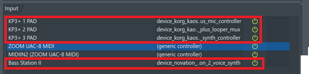
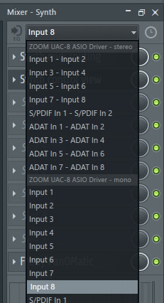

[Go to the previous page](../../README.md#sub-articles)

----

# Installation

In order to install the project one would need to:

- Install the [DAW](#daw)
- Install the [External VST plugins](#vst-plugins), and make sure that the DAW sees them
- Clone this git repository
- Connect and set-up your audio interface
- Connect your input devices ( mic, synth ) to your audio interface
- Connect the KP3+ instances to your PC via the USB and set-up the drivers
- Copy the **"${project_root}\device_KorgKaossPad3Plus_LooperMux"** folder to the **"C:\Users\<your_user>\Documents\Image-Line\FL Studio\Settings\Hardware"**
- Copy the **"${project_root}\device_KorgKaossPad3Plus_SynthController"** folder to the **"C:\Users\<your_user>\Documents\Image-Line\FL Studio\Settings\Hardware"**
- Copy the **"${project_root}\device_KorgKaossPad3Plus_MicController"** folder to the **"C:\Users\<your_user>\Documents\Image-Line\FL Studio\Settings\Hardware"**
- Copy the **"${project_root}\commmon"** folder to the **"{fl_studio_root}\Shared\Python\Lib"**
- Copy the **"${project_root}\input_controller"** folder to the **"{fl_studio_root}\Shared\Python\Lib"**
- Open the **"live_looping.flp"** project inside the DAW
- Enter the MIDI settings:

  

- Assign the scripts to the KP3+ instances:

  

  **Note!** In my case, one of the KP3+ is sending MIDI data through the ZOOM UAC-8 MIDI. That's why you see **"KP3+ 1 PAD"**, **"KP3+ 2 PAD"** and **"ZOOM UAC-8 MIDI"**. Anyway, the roles are properly assigned:
  
  * **"KP3+ 1 PAD"** - device_KorgKaossPad3Plus_SynthController
  * **"KP3+ 2 PAD"** - device_KorgKaossPad3Plus_LooperMux
  * **"ZOOM UAC-8 MIDI** - device_KorgKaossPad3Plus_MicController
  
  In your case the **"ZOOM UAC-8 MIDI** might be replaced with **"KP3+ 3 PAD"**. That's it

- Move each KP3+ instance to the "MIDI Controller" mode, using the **"Shift + 8"** shotcut
- Move the knobs and see whether the logical device's views react on the input
- Enter the mixer view:

  

- Visit channel 6 and assign the input source in a way that your mic's signal goes there:

  

- Visit channel 10 and assign the input source in a way that your synth's ( or any second instrument's ) signal goes there:

  

  **Note!** In the above 2 steps the "Input X", which you'll select will depend on commutation of your hardware. Do not blindly follow this instruction :)

- Check, whether you hear your instruments in the headphones. If yes - **then my congratulations**!

**You are ready to go!**

----

[Go to the previous page](../../README.md#sub-articles)