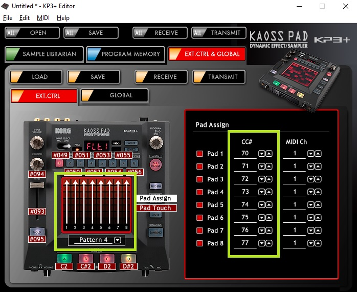
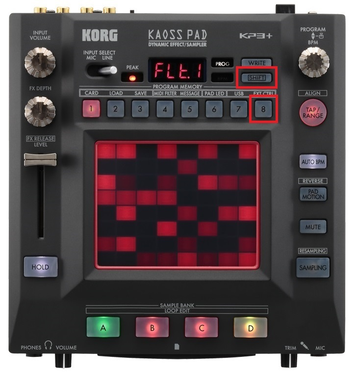
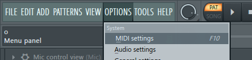
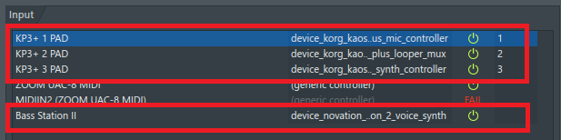
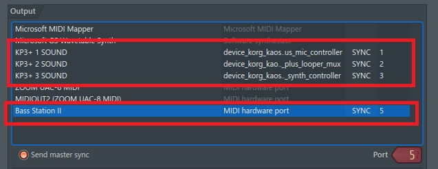
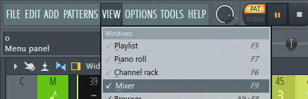
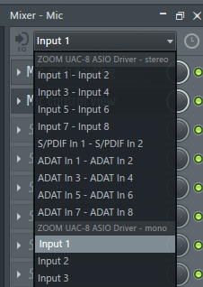

[Go to the previous page](../../README.md#sub-articles)

----

# Installation

In order to install the project one would need to:

- Install the [DAW](../prerequisites/prerequisites.md#daw)
- Install the [External VST plugins](../prerequisites/prerequisites.md#vst-plugins), and make sure that the DAW sees them
- Clone this git repository
- Connect and set up your audio interface
- Connect your input devices ( mic, synth ) to your audio interface
- Connect the KP3+ instances to your PC via the USB and set up the drivers
- Start the "KP3+ Editor" and set each KP3+ instance to use "Pattern 4" for the touch screen:

  
  
  We need this setting to be applied, as the touch screen is being used as 8 independent vertical sliders. Also, make sure, that the used CC# for the sliders are from 70 to 77.

- Use **"Shift + 8"** short-cut on each instance of the KP3+ to switch it to **"EXT CTRL"** mode:

  

- Copy the **"${project_root}\device_korg_kaoss_pad_3_plus_looper_mux"** folder to the **"C:\Users\<your_user>\Documents\Image-Line\FL Studio\Settings\Hardware"**
- Copy the **"${project_root}\device_korg_kaoss_pad_3_plus_synth_controller"** folder to the **"C:\Users\<your_user>\Documents\Image-Line\FL Studio\Settings\Hardware"**
- Copy the **"${project_root}\device_korg_kaoss_pad_3_plus_mic_controller"** folder to the **"C:\Users\<your_user>\Documents\Image-Line\FL Studio\Settings\Hardware"**
- Copy the **"${project_root}\device_novation_bass_station_2_voice_synth"** folder to the **"C:\Users\<your_user>\Documents\Image-Line\FL Studio\Settings\Hardware"**
- Copy the **"${project_root}\commmon"** folder to the **"{fl_studio_root}\Shared\Python\Lib"**
- Copy the **"${project_root}\input_controller"** folder to the **"{fl_studio_root}\Shared\Python\Lib"**
- Replace the **"C:\Users\<YOUR_USERNAME>\Documents\Sugar Bytes\Turnado\Global Presets"** with te content of **"${project_root}\presets\Turnado\Global Presets"**
- Open the **"live_looping.flp"** project inside the DAW
- Enter the MIDI settings:

  

- Assign the scripts to the KP3+ instances and to the Novation Bass Station 2. Also, select the input MIDI ports:

  
  
  * **"KP3+ 1 PAD"** - device_korg_kaoss_pad_3_plus_synth_controller. Select the MIDI port **#1**
  * **"KP3+ 2 PAD"** - device_korg_kaoss_pad_3_plus_looper_mux. Select port the MIDI port **#2**
  * **"KP3+ 3 PAD"** - device_korg_kaoss_pad_3_plus_mic_controller. Select the MIDI  port **#3**
  * **"Bass Station II"** - device_novation_bass_station_2_voice_synth

- Set "Send master sync option" and select the output MIDID ports:

  

  * **"KP3+ 1 PAD"** - Select the MIDI port **#1**
  * **"KP3+ 2 PAD"** - Select the MIDI port **#2**
  * **"KP3+ 3 PAD"** - Select the MIDI port **#3**
  * **"Bass Station II"** - Select the MIDI port **#5**

The only mandatory thing here is port #5 for Novation Bass Station 2, so it could receive the BPM sync from the DAW. Still, for other devices the output ports are also set to ensure the separation of the MIDI signals handling.

- Move the knobs and see whether the logical device's views react to the input
- Enter the mixer view:

  

- Visit channel 7 and assign the input source in a way that your mic's signal goes there:

  

  **Note!** In the above step the "Input X", which you'll select will depend on computation of your hardware. Do not blindly follow this instruction :)

- Press "Function + MIDI Chan" buttons on the Novation Bass Station 2 and select channel 5

- Check:
  - whether the mic works and you can hear your voice in the headphones
  - whether GUI views are reacting on the actions on the KP3+ instances
  - whether Novation Bass Station 2 sends MIDI signals to the crossfade loop synth

  If answers to all the above points are "yes" - **then my congratulations**!

**You are ready to go!**

----

[Go to the previous page](../../README.md#sub-articles)