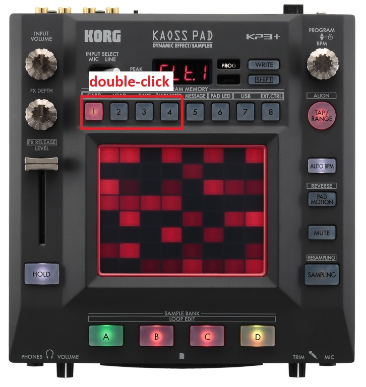

[Go to the previous page](../../README.md#sub-articles)

----

# Table of contents

- ["Looper mux" logical device](#looper-mux-logical-device)
  * [Selecting the looper instance](#selecting-the-looper-instance)
  * [Selecting the sample length](#selecting-the-sample-length)
  * [Recording audio to the track](#recording-audio-to-the-track)
  * [Erasing the track](#erasing-the-track)
  * [Changing the volume of the loopers](#changing-the-volume-of-the-loopers)
  * [Resetting the looper](#resetting-the-looper)
  * [Resseting the looper mux](#resseting-the-looper-mux)
  
----

# "Looper mux" logical device

## Selecting the looper instance

The "looper mux" logical device consists of 4 looper instaces:

By default looper **#1** is selected.

You can switch to other loopers using the **"Hold + X"** shortcut on KP3+, where X is one of the digits from 1 to 4:

**Note!** When you are selecting the looper, majority of the parameters will represent the state of the selected looper, leaving the non-selected loopers in shadow.

----

## Selecting the sample length

After the target looper is selected, the next thing any normal looper would think of is to select the length of the recorded phrase:

The supported sample lengths are from 1, 2, 4, 8, 16, 32, 64 and 128 beats. You can select the length using the 1-8 digits:

----

## Recording audio to the track

Each looper instance has 4 tracks:

So, in sum you have 4 loopers * 4 tracks = 16 tracks to work with.

Someone would say that it is not enough, and it would be better to have unlimited number of tracks. I'm saying:
- It is already more than in majority of the available physical loopers
- Constraints increase your creativity
- Do not judge yet, as there is a resampling functionality, which allows you to resample multiple tracks back to any other track. Be patient :)

You can start recording to the track using the A, B, C, D buttons on the KP3+ instance:

**A** button will start recording on the first track of the selected looper.

**B** - on the second.

**C** - on third.

**D** - on fourth.

Quite intuitive.

Once the recording is started, the view will reflect that:

The following things will change:
- The **Recording** status label of the selected track will become red.
- The **Length** value will change from 000 to the active length value.

In order to stop the recording - press the button of the recorded track ( A, B, C or D ) once again.

The view will change its status to play-back:

**Note!** I should mention the following aspects here:
- If recording is not stopped after reaching the "sample length", the second and further layers will be recorded on top of the initially recorded phrase. So, remember to stop recording in  time. In other cases it might be even a usefull feature, e.g. in order to make a vocal chords.
- If recording is being stopped and is then started again to the same track, 2 variants are possible:
  * If the sample length of the track **IS EQUAL** to the currently selected sample length - additional audio data will be layered on top of the existing audio materials
  * If the sample length of the track **IS NOT EQUAL** to the currently selected sample length - the track will be cleared and new data will be recorded instead of it
- If recording to the track X is ongoing, but you are starting recording to the Y track - recording of X track will stop
- If recording to the track X is ongoing, but you are selecting another active looper - the recording of track X will stop

----

## Erasing the track

In order to erase the track you the **"Hold + X"** shortcut on KP3+, where X is one of the track buttons from A to D:

Once clear option is selected, the clear button of the track will blink once in the view:

Once the track is erased, the view will change its state to "all off":

As you can see, there are no active status anymore. Also, that length of the track is reset to 000.

**Note!** Erasing the track **DOES NOT** stop recording to it. It is a useful option, as it allows you to instantly clear the part of the audio, which has an "error", without stopping further recording. You can consider it as a fast "let's try it again" option.

----

## Changing the volume of the loopers

The volume of the selected looper can be changed using the level fader of the KP3+:

The view will reflect it on the **"Volume"** slider inside the DAW:

On top of that you can instantly mute and unmute each individual looper by double clicking on digits 1 to 4:

The used number identifies the number of the affected looper.

The mute status would be reflected in the view:

Moreover, the looper's volume value would also change to 0:

**Note!** Actually, the mute tearm means "set the volume of the looper to 0%". And unmute means "set the volume of the looper to 100%". So, both approaches to set the looper volume ( via level fader and via double-click ) do actually operate on the same "Volume" parameter. That also means, that any touch to the volume fader will "unmute" the selected looper, as it will change the value of the volume parameter.

**Note!** If looper has non-zero volume ( even if it is 1% ), it is considered as unmuted. Thus, the first double-click will first set the volume to 0.

----

# Resetting the looper

You can reset a single looper to the initial state, using the **"Hold + 7"** shortcut:

That will erase all recorded tracks and set all the looper's parameters back to initial state.

----

# Resseting the looper mux

You can reset the whole "looper mux" logical device, using the **"Hold + 8"** shortcut:

That will reset each individual looper. Also it will set all non-looper-specific parameters back to the initial state.

**Note!** Resetting the looper mux changes its state to "non-playing" mode. In this state you can change the tempo.

----

[Go to the previous page](../../README.md#sub-articles)