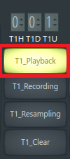
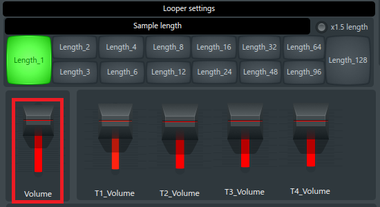

[Go to the previous page](../../README.md#sub-articles)

----

# Table of contents

- ["Looper mux" logical device](#looper-mux-logical-device)
  * [Selecting the active looper instance](#selecting-the-active-looper-instance)
  * [Selecting the sample length](#selecting-the-sample-length)
  * [Recording audio to the track](#recording-audio-to-the-track)
  * [Erasing the track](#erasing-the-track)
  * [Changing the volume of the loopers](#changing-the-volume-of-the-loopers)
  * [Changing the volume of the tracks](#changing-the-volume-of-the-tracks)
  * [Resetting the looper](#resetting-the-looper)
  * [Resetting the looper mux](#resetting-the-looper-mux)
  * [Changing the tempo](#changing-the-tempo)
  * [Resampling](#resampling)
    * [Resampling within the selected looper](#resampling-within-the-selected-looper)
	* [Resampling all loopers](#resampling-all-loopers)
  * [Applying Turnado effect to the looper](#applying-turnado-effect-to-the-looper)
  
----

# "Looper mux" logical device

## Selecting the active looper instance

The "looper mux" logical device consists of 4 looper instaces:

By default looper **#1** is selected.

You can switch to other loopers using the **"Hold + X"** shortcut on KP3+, where X is one of the digits from 1 to 4:

**Note!** When you are selecting the looper, majority of the parameters will represent the state of the selected looper, leaving the non-selected loopers in shadow.

----

## Selecting the sample length

After the target looper is selected, the next thing any normal looper would think of is to select the length of the recorded phrase:

The supported sample lengths are from 1, 2, 4, 8, 16, 32, 64 and 128 beats. You can select the length using the 1-8 digits:

----

## Recording audio to the track

Each looper instance has 4 tracks:

So, in sum you have 4 loopers * 4 tracks = 16 tracks to work with.

Someone would say that it is not enough, and it would be better to have unlimited number of tracks. I'm saying:
- It is already more than in majority of the available physical loopers
- Constraints increase your creativity
- Do not judge yet, as there is a resampling functionality, which allows you to resample multiple tracks back to any other track. Be patient :)

You can start recording to the track using the A, B, C, D buttons on the KP3+ instance:

**A** button will start recording on the first track of the selected looper.

**B** - on the second.

**C** - on third.

**D** - on fourth.

Quite intuitive.

Once the recording is started, the view will reflect that:

The following things will change:
- The **Recording** status label of the selected track will become red.
- The **Length** value will change from 000 to the active length value.

In order to stop the recording - press the button of the recorded track ( A, B, C or D ) once again.

The view will change its status to play-back:

**Note!** I should mention the following aspects here:
- If recording is not stopped after reaching the "sample length", the second and further layers will be recorded on top of the initially recorded phrase. So, remember to stop recording in  time. In other cases it might be even a usefull feature, e.g. in order to make a vocal chords.
- If recording is being stopped and is then started again to the same track, 2 variants are possible:
  * If the sample length of the track **IS EQUAL** to the currently selected sample length - additional audio data will be layered on top of the existing audio materials
  * If the sample length of the track **IS NOT EQUAL** to the currently selected sample length - the track will be cleared and new data will be recorded instead of it
- If recording to the track X is ongoing, but you are starting recording to the Y track - recording of X track will stop
- If recording to the track X is ongoing, but you are selecting another active looper - the recording of track X will stop

----

## Erasing the track

In order to erase the track you the **"Hold + X"** shortcut on KP3+, where X is one of the track buttons from A to D:

Once clear option is selected, the clear button of the track will blink once in the view:

Once the track is erased, the view will change its state to "all off":

As you can see, there are no active status anymore. Also, that length of the track is reset to 000.

**Note!** Erasing the track **DOES NOT** stop recording to it. It is a useful option, as it allows you to instantly clear the part of the audio, which has an "error", without stopping further recording. You can consider it as a fast "let's try it again" option.

----

## Changing the volume of the loopers

The volume of the selected looper can be changed, using the level fader of the KP3+:

Alternatively, you can instantly change the volume of the individual looper between 0 and 100 by double clicking on digits 1 to 4:

The used number identifies the number of the affected looper.

In both cases, the view will reflect the changes on the **"Volume"** slider inside the DAW:

Also, the 0 volume status of each looper would be reflected in the view:

**Note!** If looper has non-zero volume ( even if it is 1 ), it is considered as unmuted. In such a case, the first double-click will set the volume of the looper to 0.

----

## Changing the volume of the tracks

The volume of the tracks of the selected looper can be changed, using the first 4 vertical faders on the touch screen:

Alternativaly, you can instantly change the volume of each track, by double-clicking the digits from 5 to 8:

Digit **5** will impact **track #1**.

Digit **6** - track **track #2**.

Digit **7** - **track #3**.

Digit **8** - **track #4**.

In both cases, the view will reflect the changes of the volume of each track inside the DAW:

----

## Resetting the looper

You can reset a single looper to the initial state, using the **"Hold + 7"** shortcut:

That will erase all recorded tracks and set all the looper's parameters back to initial state.

----

## Resseting the looper mux

You can reset the whole "looper mux" logical device, using the **"Hold + 8"** shortcut:

That will reset each individual looper. Also it will set all non-looper-specific parameters back to the initial state.

**Note!** Resetting the looper mux changes its state to "non-playing" mode. In this state you can change the tempo.

----

## Changing the tempo

Currently, the change of the tempo in the middle of the jamming session is not supported. That is caused by the underlying "Augustus loop" VST plugin, which ruines the sync between the tracks once the tempo was changed.

Thus, the change is allowed only when the "looper mux" device **IS NOT** in the **Play** mode.

In order to change the tempo:

- Check whether "looper mux" is in the playing mode or not:

  

- If "looper mux" is playing, [reset it](#resetting-the-looper-mux), to allow the tempo change.

  **Note!** Any input to the "looper mux" except the tempo change will switch it back to the playing mode.

- Then, use the "FX DEPTH" on the KP3+ to change the tempo:

  

  The change of the tempo will be reflected in the view:
  
  

  **Note!** The supported tempo range is from **80** to **180** BPM. Actually, there is no any limitation on that. It is done only to allow faster selection of the tempo from the most frequently used BPM range.
  
  **Note!** The tempo change is done in jumps by **5** BPM-s: 80, 85, 90, 95, etc. The reason is the same - to allow select the target BPM faster.

- After the target BPM was selected, you can proceed with any other actions.

----

## Resampling

Usually, the liveloopig artist is sampling the audio input to one of the tracks of the looper device:

But there are use-cases, when you need to resample the already recorded sounds back to one of the tracks.

The project supports 2 ways of resampling:

- Resampling of output of the looper to the specified track:

  

- Resampling of output of all the loopers to the specified track:

  

The obvious use-cases for resampling are:
- You've got all 16 tracks already recorded, but you do not want to erase what is already playing. In such case, you can:
  - resample 15 tracks of all loopers back to one of the tracks
  - resample 3 tracks of individual looper back to one of the tracks
  It'll save majority of the sound information and will let you have empty tracks to move on.
- In order to achieve the richer sound, you want to add additional effects on top of what was already recorded, and record the modified sound back to one of the tracks.

Both use-cases are valid for the LIVELOOPING project.

**Note!** As of now, there is only one instance of Turnado VST assigned to each looper. So one could say, that capabilities to change the already recorded sounds are limited. Still, even this single thing is VERY POWERFUL. See the corresponding [section](#applying-turnado-effect-to-the-looper)

----

### Resampling within the selected looper

In order to resample within the selected looper:

- Use the **"Hold + 5"** shortcut to activate the **"Resample selected looper"** mode:

  

  The view will reflect this in the following way within the DAW:

  

- Start [recording](#recording-audio-to-the-track) as usual. You will see, that instead of the "Recording" state, the selected track will show the "Resampling" state:

  

- Stop [recording](#recording-audio-to-the-track) as usual.

- After recording is finished, all the tracks, which were recorded to the target track would be automatically muted:

  
  
  The content of those track would be still available. So you can turn them back on in case if needed.
  
  The volume of the target resampling track would be restored to 100.

----

### Resampling all loopers

In order to resample all loopers:

- Use the **"Hold + 6"** shortcut to activate the **"Resample all loopers"** mode:

  

  The view will reflect this in the following way within the DAW:
  
  

- Start [recording](#recording-audio-to-the-track) as usual. You will see, that instead of the "Recording" state, the selected track will show the "Resampling" state:

  

- Stop [recording](#recording-audio-to-the-track) as usual.

- After recording is finished, all the tracks, which were recorded to the target track would be automatically **CLEARED**:

  
  
  This aspect is different to resampling within the single looper. The intention is that in this case it would be hard to keep the status of the 15 resampled tracks under control. Thus, it is better erase them.

----

## Applying Turnado effect to the looper

----

[Go to the previous page](../../README.md#sub-articles)