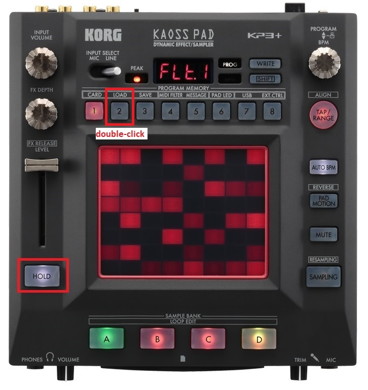
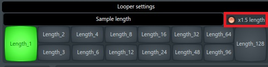
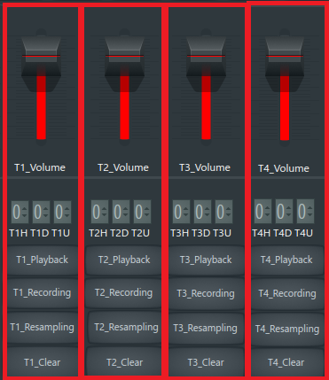
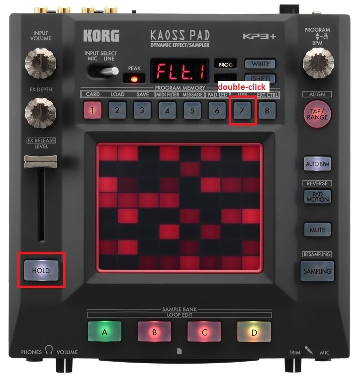
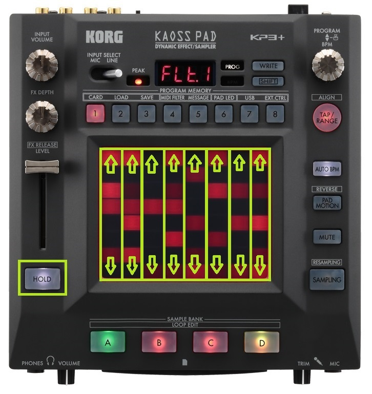
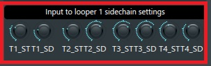
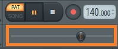
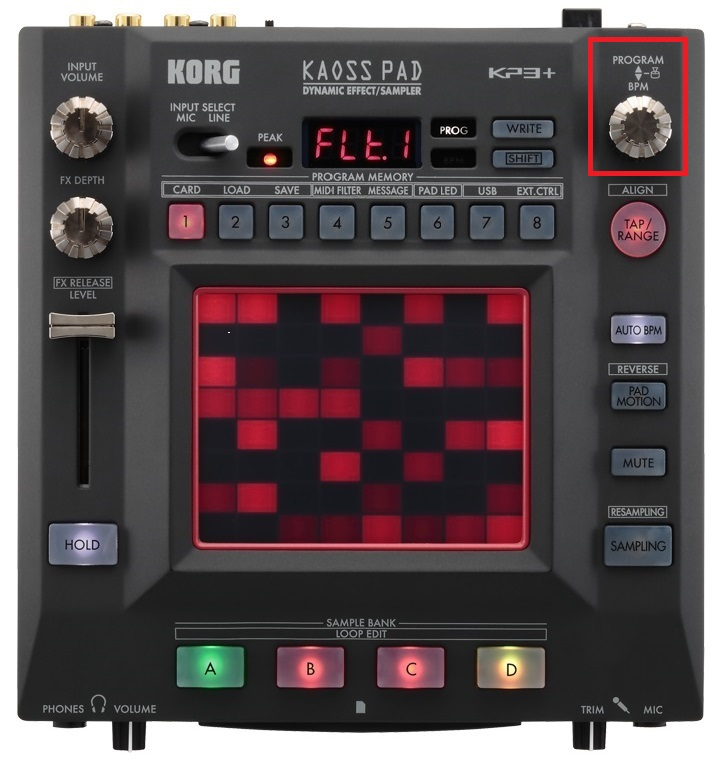

[Go to the previous page](../../README.md#sub-articles)

----

# Table of contents

- ["Looper mux" logical device](#looper-mux-logical-device)
  * [Predefined track roles](#predefined-track-roles)
  * [Selecting the active looper instance](#selecting-the-active-looper-instance)
  * [Selecting the sample length](#selecting-the-sample-length)
  * [Recording audio to the track](#recording-audio-to-the-track)
  * [Erasing the track](#erasing-the-track)
  * [Changing the volume of the loopers](#changing-the-volume-of-the-loopers)
  * [Changing the volume of the tracks](#changing-the-volume-of-the-tracks)
  * [Resetting the looper](#resetting-the-looper)
  * [Resetting the looper mux](#resetting-the-looper-mux)
  * [Changing the tempo](#changing-the-tempo)
  * [Resampling](#resampling)
    * [Resampling within the selected looper](#resampling-within-the-selected-looper)
	* [Resampling all loopers](#resampling-all-loopers)
  * [Applying Turnado effect to the looper](#applying-turnado-effect-to-the-looper)
	* [Changing the Turnado dictator value](#changing-the-turnado-dictator-value)
	* [Changing the Turnado Dry/Wet value](#changing-the-turnado-dry-wet-value)
	* [Randomizing Turnado](#randomizing-turnado)
	* [Switching between the Turnado VST presets](#switching-between-the-turnado-vst-presets)
  * [Drop FX](#drop-fx)
  * [Sidechain](#sidechain)
	* [Loopers sidechain levels](#loopers-sidechain-levels)
	* [Sidechain source parameters](#sidechain-source-parameters)
  * [DAW transport sync](#daw-transport-sync)
  
----

# "Looper mux" logical device

The "looper-mux" logical device is a thing that allows you to manage the recording of the looped audio phrases. I can say that its purpose is to replace the RC-505 :)

## Predefined track roles

Looper 1 Track 1 - Kick drum
Looper 1 Track 2 - Snare drum
Looper 1 Track 3 - Hats

Why is that important?

- Snare and hats tracks have specific EQ settings assigned to them
- Each channel from the above list produces specific sidechain data filtered by specific frequencies. It allows you to achieve the multiband sidechain effect from the drums on loopers 2, 3, and 4.

## Selecting the active looper instance

The "looper mux" logical device consists of 4 looper instances:

By default looper **#1** is selected.

You can switch to other loopers using the **"Hold + X"** shortcut on KP3+, where X is one of the digits from 1 to 4, depending on which looper instance you want to select:

**Note!** When you are selecting the looper, the majority of the parameters will represent the state of the selected looper, leaving the parameters of the non-selected loopers in shadow.

----

## Selecting the sample length

After the target looper is selected, the next thing any looper artist would think of is to select the length of the recorded phrase:

The supported sample lengths are 1, 2, 3, 4, 6, 8, 12, 16, 24, 32, 48, 64, 96 and 128 beats. By default you can select the 1, 2, 4, 8, 16, 32, 64, 128 lengths using the **1-8** digits:

To be able to select lengths 3, 6, 12, 24, 48, 96 you need to enter the '1.5x length' mode. You can do it with the **Hold + 2** double click:

The UI will react in the following way:

The same thing should be done again to leave the '1.5x length' mode.

**Note** 1.5X recording length mode is turned off once the looper mux was reset.

----

## Recording audio to the track

Each looper instance has 4 tracks:

So, in sum, you have 4 loopers * 4 tracks = 16 tracks to work with.

Someone would say that it is not enough, and it would be better to have an unlimited number of tracks. But I'm saying that:
- It is already more than in the majority of the available physical loopers
- Constraints increase your creativity
- Do not judge yet, as there is a resampling functionality, which allows you to resample multiple tracks back to any other track. Be patient :)

You can start recording to the track using the A, B, C, D buttons on the KP3+ instance:

**A** button will start recording on the first track of the selected looper.

**B** - on the second.

**C** - on third.

**D** - on fourth.

Quite intuitive.

Once the recording is started, the view will reflect that:

The following things will change:
- The **Recording** status label of the selected track will become red.
- The **Length** value will change from 000 to the active length value.

In order to stop the recording - press the button of the recorded track ( A, B, C, or D ) once again.

The view will change its status to play-back:

**Note!** I should mention the following aspects here:
- If the recording is not stopped after reaching the "sample length", the second and further layers will be recorded on top of the initially recorded phrase. So, remember to stop recording in time. In some cases, it might be a useful feature, e.g. in order to make vocal chords.
- If the recording is being stopped and is then started again to the same track, 2 variants are possible:
  * If the sample length of the track **IS EQUAL** to the currently selected sample length - additional audio data will be layered on top of the existing audio material
  * If the sample length of the track **IS NOT EQUAL** to the currently selected sample length - the track will be cleared and the new data will be recorded to it from scratch
- If recording to the track X is ongoing, but you are starting recording to the Y track - recording of X track will be stopped
- If recording to the track X is ongoing, but you are selecting another active looper - the recording of track X will be stopped

----

## Erasing the track

In order to erase the track you can use the **"Hold + X"** shortcut on KP3+, where X is one of the track buttons from A to D, depending on the track you want to erase:

Once the clear option is selected, the clear button of the track will blink once in the view:

Once the track is erased, the view will change its state to "all off":

As you can see, there is no active status anymore. Also, the length of the track is reset to 000.

**Note!** If recording is active, erasing the track **DOES NOT** stop recording to it. It is a useful option, as it allows you to instantly clear the part of the audio, which has an "error", without stopping further recording. You can consider it as a fast "let's try it again" option.

----

## Changing the volume of the loopers

The volume of the selected looper can be changed, using the level fader of the KP3+:

Alternatively, you can instantly change the volume of the individual looper between 0 and 100 by double-clicking on digits 1 to 4:

The used number identifies the number of the target looper.

In both cases, the view will reflect the changes on the **"Volume"** slider inside the DAW:

Also, the 0 volume status of each looper would be reflected in the view:

**Note!** If the looper has non-zero volume ( even if it is 1 ), it is considered unmuted. In such a case, the first double-click will set the volume of the looper to 0.

----

## Changing the volume of the tracks

The volume of the tracks of the selected looper can be changed, using the first 4 vertical faders on the touch screen:

Alternatively, you can instantly change the volume of each track, by double-clicking the digits from 5 to 8:

Digit **5** will impact **track #1**.

Digit **6** - track **track #2**.

Digit **7** - **track #3**.

Digit **8** - **track #4**.

In both cases, the view will reflect the changes of the volume of each track inside the DAW:

----

## Resetting the looper

You can reset a single looper to the initial state, using the **"Hold + double-click on digit 7"** shortcut:

That will erase all recorded tracks and set all the looper's parameters back to the initial state.

**Note!** The other loopers will keep their status unchanged.

----

## Resetting the looper mux

You can reset the whole "looper mux" logical device, using the **"Hold + double-click on digit 8"** shortcut:

That will reset each individual looper. Moreover, it will set all non-looper-specific parameters back to the initial state.

The "Clear all" button in the view will blink once, and the "Play" mode will be turned off:

**Note!** Resetting the looper mux changes its state to "non-playing" mode, **in which you can change the tempo.**

----

## Changing the tempo

Currently, the change of tempo in the middle of the jamming session is not supported. That is caused by the underlying "Augustus loop" VST plugin, which ruins the sync between the tracks once the tempo was changed.

Thus, the change is allowed only when the "looper mux" device **IS NOT** in the **Play** mode.

In order to change the tempo:

- Check whether "looper mux" is in the playing mode or not:

  

- If "looper mux" is playing, [reset it](#resetting-the-looper-mux), to allow the tempo change.

  **Note!** Any input to the "looper mux" except the tempo change will switch it back to the playing mode. So apply the tempo change right after stopping the looper mux.

- Then, use the "FX DEPTH" on the KP3+ to change the tempo:

  

  The change of the tempo will be reflected in the view:
  
  

  **Note!** The supported tempo range is from **80** to **180** BPM. Actually, there is no limitation on that. It is done only to allow faster selection of the tempo from the most frequently used BPM range.
  
  **Note!** The tempo change is done in jumps by **5** BPM-s: 80, 85, 90, 95, etc. The reason is the same - to allow selecting the target BPM faster.

- After the target BPM is selected, you can proceed with any other actions.

----

## Resampling

Usually, the live looping artist is sampling the audio input to one of the tracks of the looper device:

But there are use-cases when you need to resample the already recorded sounds back to one of the tracks.

The **LIVELOOPING** project supports 2 ways of resampling:

- Resampling of the output of the selected looper to the specified track:

  

- Resampling of the output of all the loopers to the specified track:

  

The obvious use-cases for resampling are:
- You've got all 16 tracks already recorded, but you do not want to erase what is already playing. In such case, you can:
  - resample 3 tracks of the selected looper back to any track of that looper
  - resample 15 tracks of all loopers back to one of the tracks of the selected looper
  It'll save the majority of the sound information and will let you have empty tracks to move on.
- In order to achieve the richer sound, you want to add additional effects on top of what was already recorded and record the modified sound back to one of the tracks.

**Note!** As of now, there is only one instance of Turnado VST assigned to each looper. So one could say, that capabilities to change the already recorded sounds are limited. Still, even this single thing is VERY POWERFUL. See the [corresponding section](#applying-turnado-effect-to-the-looper)

----

### Resampling within the selected looper

In order to resample within the selected looper:

- Use the **"Hold + 5"** shortcut to activate the **"Resample selected looper"** mode:

  

  The view will reflect this in the following way within the DAW:

  

- Start [recording](#recording-audio-to-the-track) as usual. You will see, that instead of the "Recording" state, the selected track will show the "Resampling" state:

  

- Once done, [stop the recording](#recording-audio-to-the-track) as usual.

- After the recording is finished, all the tracks, which were recorded to the target track would be automatically cleared:

  
    
  The volume of the target resampling track would be restored to 100%.

----

### Resampling all loopers

In order to resample all loopers:

- Use the **"Hold + 6"** shortcut to activate the **"Resample all loopers"** mode:

  

  The view will reflect this in the following way within the DAW:
  
  

- Start [recording](#recording-audio-to-the-track) as usual. You will see, that instead of the "Recording" state, the selected track will show the "Resampling" state:

  

- Once done, [stop the recording](#recording-audio-to-the-track) as usual.

- After the recording is finished, all the tracks, which were recorded to the target track would be automatically **CLEARED**:

  
  
  This aspect is different from resampling within the single looper. The intention is that in this case, it would be hard to keep the status of the 15 resampled tracks under control. Thus, it is better to erase them.

----

## Applying Turnado effect to the looper

As of now, Turnado is the one and only effect, which you can apply on top of the recorded data. Still, in many cases, it might be enough, as it provides infinite possibilities to randomly change your sounds.

The idea behind the Turnado VST is the following one:
- Turnado provides 24 different effects.
- Out of those 24 effects you can select 8 active effects and fine-tune them.
- Turnado has a "dictator" killing feature, which allows you to manipulate 8 active effects with one single fader.
- This VST has a "randomize" option, which can randomly change everything - active effects, their setting, settings of the dictator fader.

In the "looper mux" logical device I've integrated usage of the 2 last points. You can use the dictator fader and randomize the effects.

Important point is that each looper has a dedicated instance of Turnado assigned to it. So you can have 4 different loopers having applied 4 different sets of complex effects. Be careful, as it might blow your mind!

----

### Changing the Turnado dictator value

In order to change the turnado dictator value, use the **"FX DEPTH"** knob on the KP3+:

Changing that parameter will do the following thing on Turnado's side:

The view will reflect this in the following way within the DAW:

----

### Changing the Turnado Dry-Wet value

In order to change the turnado dictator value, use the **"Hold + FX DEPTH"** shortcut on the KP3+:

The view will reflect this in the following way within the DAW:

----

### Randomizing Turnado

In order to randomize the Turnado use the **" double-click on the Hold button"** short-cut:

The short-cut will change the selected effects, their settings, and split between effects within the dictator section.

The view does not reflect that. There seems to be no real reason to visualize that.

**Note!** in order to use the randomize function, you need to have Turnado instance be **IN FOREGROUND** within the DAW. That's why you'll find all Turnado instances being hidden somewhere in the right bottom corner of the screen, while still being in foreground. It is done by intention. Do not close them.

----

### Switching between the Turnado VST presets

The "Randomize" option is quite handy, but sometimes it gives unpredictable results.

Thus, it is more common to switch between the fine-tuned pre-saved presets. In order to do that, one could use **"Hold + double-click on digit 5"** short-cut to switch to the previous preset. Or **"Hold + double-click on digit 6"** short-cut to switch to the next preset:

In the view, the corresponding buttons will blink in case of usage:

**Note!** The presets mentioned here are simple VST presets. They are not the composite presets implemented by the **LIVELOOPING** project.

----

## Drop FX

Look at the GBB contesters. They all are doing **DROPS** in their tracks.

A special feature is here to help out with that.

It is a mixture of reverb, delay and filter applied on top of all the loopers output, which allows you to create a "drop-is-coming" effect with one single fader.

In order to mix-in the Drop FX use the "Hold + level" short-cut on KP3+ side:

As you can see above, it is a reverse controller, where the down point of the fader means the maximum application of the effect. It was done like that as it plays better within the overall workflow.

The view will reflect it in the following way within the DAW:

To apply the **DROP**, use the **"Hold + double-click on digit 1"** short-cut on the KP3+ side:

**Note!** Application of the drop will:
- Disable the Drop Fx
- Recover volume of looper #1 to 100
- Recover volume of each track of the looper #1 to 100
- Turn off the Turnado FX

So, the best practice regarding this feature is to:
- Switch to the looper #1, which usually contains the drums
- Turn off some of the drums and apply the Drop FX
- Apply some turnado magic
- Sing something special
- And finally - apply the drop :)

----

## Sidechain

In terms of this project the sidechain means, that tracks 1 ( kick ), 2 ( snare ) and 3 ( hats ) of the looper #1 can independently:
1. impact the volume of the input sources ( mic, synth, etc. ) - handled by the [input controller](../input-controller/input-controller.md#sidechain-source-levels)
2. impact the volume of the other loopers - handled by the looper mux

The most obvious use-case for point #2:
- Record material without the sidechain
- Apply/remove it later on

----

### Loopers sidechain levels

**Note!** It does not make logical sense to allow looper #1 to side-chain to its own tracks. Thus, it is not possible to adjust these levels for looper #1, but only for the other loopers.

In order to change the sidechain levels of the selected looper, use the **"5-8 vertical faders"** on the KP3+ touch screen:

Fader **5** will change the sidechain level to the **track #1 ( kick )** of the **looper #1**. The low-frequency filter is applied to this track's sidechain data, impacting the target's low frequency.

Fader **6** - to the track **track #2 ( snare )** of the **looper #1**. The low-mid frequency filter is applied to this track's sidechain data and impacts the target's mid-frequency.

Fader **7** - to the track **track #3 ( hats )** of the **looper #1**. The mid-high frequency filter is applied to this track's sidechain data and impacts the target's high frequency.

Fader **8** - to the track **track #1 ( kick )** of the **looper #1**. In this case, sidechain data is NOT filtered by frequency, and it impacts the VOLUME of the target.

The view will reflect that in the following way within the DAW:

----

### Sidechain source parameters

There are 2 parameters you can adjust regarding the source of the sidechain. Those are tension and decay. A combination of these 2 parameters allows you to identify a sidechain shape that will fit your track the most.

In order to change the sidechain levels of the selected looper, use the **"Hold + 1-8 vertical faders"** shortcut on the KP3+:

Fader **1** will change the side-chain decay level of the **track #1** of the **looper #1**.

Fader **2** - will change the side-chain tension level of the **track #1** of the **looper #1**.

Faders **3**, **4** - same, but for the track **track #2** of the **looper #1**.

Faders **5**, **6** - same, but for the track **track #3** of the **looper #1**.

Faders **7**, **8** - same, but for the track **track #3** of the **looper #1**.

The view will reflect that in the following way within the DAW:

**Note!** These parameters are reset to default values each time when the loopermux is [stopped](#resetting-the-looper-mux).

----

### DAW transport sync

When you start to record the track, there is no implicit synchronization of the start of your recording with the start of the FL Studio transport:

It might cause unsynchronization with sequencer-based events, e.g., Turnado. In this case, you want your track and the whole arrangement to be synchronized with the DAW transport.

To reset FL Studio's transport to the beginning at any moment, turn the "PROGRAM<->BPM" knob on the KP3+ on 1 point in any direction:

----

[Go to the previous page](../../README.md#sub-articles)