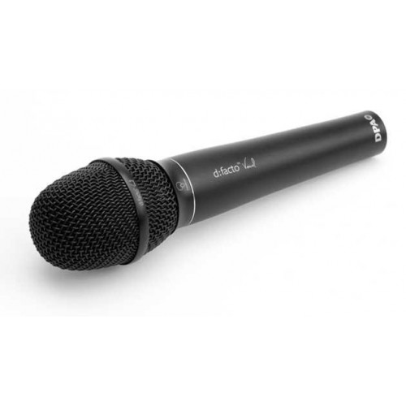

[Go to the previous page](../../README.md#sub-articles)

----

# Table of contents

- [Prerequisites](#prerequisites)
  * [DAW](#daw)
  * [VST plugins](#vst-plugins)
  * [Hardware](#hardware)

----

# Prerequisites

This project won't work out of the box, just because you have a PC. You'll need a set of certain software and hardware, to have it up and running. The list of the required preriquisites is mentioned below.

## DAW

The **FL Studio** DAW of at least **"Producer edition"** or higher - https://www.image-line.com/fl-studio/compare-editions/

Why the FL Studio was chosen?
- This is the DAW, which I'm using for more than 10 years
- It provides the python-based MIDI scripting API, which perfectly fits the task

Probably, you will need to have the latest version of the FL Studio, because:
- I've bought FL Studio and do have the lifetime updates. Thus, I'll continue to support this project against the HEAD version of the FL Studio. Old versions might become not compatible.
- Some of the previous versions have bugs inside the FL MIDI scripting engine. I do not work around them, as they were already fixed in the latest releases.

## VST plugins

The project is building the logical devices on the top of the FL Studio DAW and a bunch of the VST plugins. Here is the list of the external VST plugins, which you'll need to have on top of the FL studio in order to have the project running:

- **Endless Smile by DADA LIFE** - https://dadalife.com/plugins/

- **Turnado 2 by sugar-bytes** - https://sugar-bytes.de/turnado

- **Pro-Q 3 by fabfilter** - https://www.fabfilter.com/products/pro-q-3-equalizer-plug-in

- **Finisher VOODOO by ujam** - https://www.ujam.com/finisher/voodoo/

- **Manipulator by Polyverse Music** - https://polyversemusic.com/products/manipulator/

- **Augustus Loop by Expert Sleepers** - https://www.expert-sleepers.co.uk/augustusloop.html

Buy, and install the above set of VST plugins.

Besides the external VST plugins, a bunch of the internal FL Studio's VST plugins is also used:

- Control surface
- Fruity Limiter
- Edison
- Fruity Compressor
- Fruity Panomatic
- Fruity Fast Dist
- Fruity Stereo Enhancer
- Fruity Reverb 2
- Fruity Delay 2
- Fruity Filter
- Fruity Peak Controller

But all the above ones are part of the FL Studio delivery. So no additional worries about their availability.

## Hardware

- **2-3 instances of the Korg Kaoss Pad 3+**

    
  
  The project consists of the 3 logical devices:
  - 1 instance of the "looper mux" device. This device is in charge of the recording the tracks.
  - 2 instances of the "input controller" devices. Each instance can be used to process one audio input channel. E.g. I'm using one of such devices for the mic, and the other for the synthesizer.

  Each device is controlled by a separate instance of the **Korg Kaoss Pad 3+** - https://www.korg.com/us/products/dj/kaoss_pad_kp3_plus/

  So, to effectively use this project, you will need to have 2-3 instances of the **Korg Kaoss Pad 3+**.

  ***Important note!*** In this project, KP3+ instances are used ONLY as MIDI controllers! No effector or sampler capabilities of the device itself are being used. So, eventually, you can replace it with any other MIDI controller, which will have enough buttons and knobs. Still, you'll need to slightly change the python code, as currently assigned MIDI signals are KP3+ specific. Also, you might need to change the workflow described in the code, as the current implementation is done considering the KP3+ form factor.

- **Audio interface**

  To work with the **LIVELOOPING** project, I'm using the **Zoom UAC-8 Audio converter** - https://zoomcorp.com/en/jp/audio-interface/audio-interfaces/uac-8/.
  
    
  
  Usage of it with 96000 Hz sample rate and 512 smp buffer length allows having ~6 ms latency while having nice and stable workflow.

  But, in general, any USB 2.0 or USB 3.0 sound-card with at least 2 inputs and the possibility to work with a 96-192 Hz sample rate should be sufficient. E.g. Komplete Audio 6 by NI should also work fine - https://www.native-instruments.com/en/products/komplete/audio-interfaces/komplete-audio-6/.

- **Mic**

  If you would work with vocals or beatboxing ( like I do ), you'll definitely need a mike. For beatboxing I would suggest the following 3 models:
  - Sure SM58 - https://www.shure.com/en-US/products/microphones/sm58
  
  - Sennheiser e-945 - https://en-us.sennheiser.com/vocal-microphone-dynamic-super-cardioid-e-945
  
  - DPA d:facto FA4018 - https://www.dpamicrophones.com/handheld/vocal-microphone ( used on GBB )
  

- **Headphones**

  For sure you are free to use the speakers, but my experience shows, that you might want to practice not producing too much noise. So, usage of the headphones would be necessary. The headphones which I'm using are:
  - Beyerdynamic DT 770 PRO - https://europe.beyerdynamic.com/dt-770-pro.html
  

----

[Go to the previous page](../../README.md#sub-articles)
