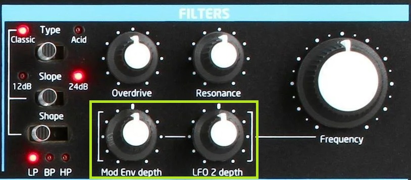

[Go to the previous page](../../README.md#sub-articles)

----

# Table of contents

- ["Voice synth" logical device](#voice-synth-logical-device)
  * [Crossfade loop](#crossfade-loop)
    * [Recording the crossfade loop](#recording-the-crossfade-loop)
	* [Attack, decay, sustain, release](#attack-decay-sustain-release)
	* [Saturation](#saturation)
	* [Loop start and end points](#loop-start-and-end-points)
	* [Hard sync](#hard-sync)
	* [Record feedback](#record-feedback)
  * [One shot samples](#one-shot-samples)
    * [Recording one-shot samples](#recording-one-shot-samples)
  * [Mode independent controllers](#mode-independent-controllers)
    * [Volume](#volume)
	* [Pan](#pan)
  * [Mic pan](#mic-pan)

----

# "Voice synth" logical device

The "voice synth" logical device is an entity that allows you to capture your own voice from the microphone and:

- create a crossfade loop out of your voice so that you can use the timbre of your voice to play it on the MIDI keyboard
- record one-shot samples from the microphone input, assign them to specific keys on the MIDI keyboard, and then trigger those samples using the keyboard

In all the above use cases the microphone input is captured after the 'input controller' effects.

The following schema shows the main idea of this logical device:

**Note!** This logical device does not have GUI in the FL Studio.

----

## Crossfade loop

### Recording the crossfade loop

Initially, the device has no input data. So the attempt to use the keyboard will lead to silence.

Use the 'Oscillators -> Sub Oscillator Octave' switch to record the crossfade loop and record some data:

- Position 1 - recording
- Position 2 - not recording

The recorded loop size is around 1 second. Recording overwrites itself. The expected workflow is the following:

- Put switch to position 1
- Simultaneously with that start to use your voice to apply the timbre. Use some beatbox sounds, e.g. siren or lip roll
- Put switch to position 2 right after recording is over
- Use the keyboard to play the sounds

**Note!** This switch works only if you are not in the 'one-shot samples' state.

**Note!** All adjustable 'crossfade loop' parameters are reset after entering 'record' mode.

----

### Attack, decay, sustain, release

When you're operating in the 'crossfade loop' mode, you can use the synth's ADSR faders in the 'Envelopes' section to change the shape of the sound:

----

### Saturation

When you're operating in the 'crossfade loop' mode, you can use the following synth's knobs to change the saturation of the sound:

The 'Effects -> Distortion' knob adjusts the saturation amount. And the 'Effects -> Osc Filter Mod' knob adjusts the saturation shape.

----

### Loop start and end points

When you're operating in the 'crossfade loop' mode, you can use the following synth's knobs to change the crossfade loop's start and end points:

- 'Mixer -> Osc 1' moves the 'start point' cursor
- 'Mixer -> Osc 2' moves the 'end point' cursor

The above parameters can select a sub-sample from the recorded piece. In some cases, it allows you to make your sound more consistent. In others - to produce some weird sound-effects. Anyway, it is a useful feature, as it helps to find the suitable timbre in real-time during the performance.

----

### Hard sync

When you're operating in the 'crossfade loop' mode, you can use the following synth's knobs to change the crossfade loop's hard sync parameters:

- 'Filters -> Mod Env Depth' adjusts the 'hard sync cycle' parameter
- 'Filters -> LFO 2 depth' adjusts the 'hard sync detune' parameter

‘Hard Sync’ borrows another concept from classic analog synths - that of oscillator sync.

In traditional synthesis, the frequency of one oscillator is forced onto the waveform of another. In Crossfade Loop Synth, this is done by adjusting the loop length so that the loop repeats at the desired audio frequency. The result is more like synthesis than sample playback - but synthesis with a waveform from the sample buffer. In effect, a kind of wavetable synthesis. By moving the loop point through your sample, you can get some nice tonal variation into your sound.

----

#### Record feedback

When you're operating in the 'crossfade loop' mode, you can change the record feedback parameter, using the 'Mixer -> Ext-Ring-Noise' knob on the synth:

‘Feedback’ controls the amount of feedback applied. At 0%, the new recording completely replaces the audio already in the buffer. At 100%, the new recording is layered on top of the old
audio. In other settings, the old audio is reduced in volume on each pass.

It allows you to record multiple layers on top of each other.

It might be helpful when you want to:

- record 2 different timbres so that they play both together. E.g. bass + lead
- record multiple notes, so that 1 single key on the keyboard is playing a chord

**Note!** All adjustable 'crossfade loop' parameters are reset after entering 'record' mode. That is done by intention. In the case of this parameter, remember the default value is '0' - no feedback. That is done to erase previously recorded data once the new recording is started. If the feedback is needed, **remember to enable it using the knob each time AFTER you've started the recording**.

----

## One-shot samples

### Recording one-shot samples

Use the 'Oscillators -> Wave' switch to switch to the one-shot samples recording state:

The positions have the following meanings:

- Sine wave - "crossfade loop" mode
- Square wave ( middle position ) - "one-shot samples" mode

The following workflow expected:

- Once you want to work with the one-shot samples - select the middle position of the mentioned switch
- Once you're in the "one-shot samples" mode, press any key on the keyboard to start recording that will be assigned to the selected key
- Simultaneously with that, provide some input from the microphone
- Release the key to stop the recording
- Press the same key once again to playback the recorded sample
- Repeat the same workflow for other keys, if that is needed

If you do not like what you've recorded and want to start from scratch - switch between modes - to 'crossfade loop' and then back to 'one-shot sample'. That will erase all previously recorded one-shot samples.

----

## Mode independent controllers

### Volume

You can change the volume of the synth, using the 'Mixer -> Sub Osc' knob on the synth:

----

### Pan

You can change the pan of the synth, using the 'Filters -> Frequency' knob on the synth:

To reset the pan to the center move the Pitch Wheel of the Novation Bass Station 2:

----

## Mic pan

As there are not enough buttons on the KP3+ an option to control the panorama of the microphone signal was moved to the voice-synth logical device.

To adjust the pan use the Mod Wheel of the Novation Bass Station 2:

To reset the pan to the center move the Pitch Wheel of the Novation Bass Station 2:

----

[Go to the previous page](../../README.md#sub-articles)
